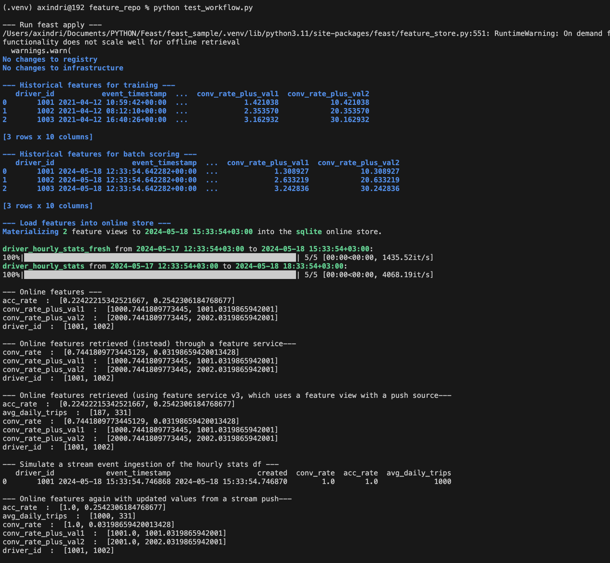

## Quick start
1. create .venv *(optional)*
   
2. Install feast
    ```bash
    pip install feast
    ```

3.  Init repository
    ```bash
    feast init my_feature_repo
    ```

4.  Go to repository
    ```bash
    cd my_feature_repo/feature_repo
    ```

5.  Build feast project
    ```bash
    feast apply
    ```

6.  Run test workflow
    ```bash
    python test_workflow.py
    ```

## Result:
